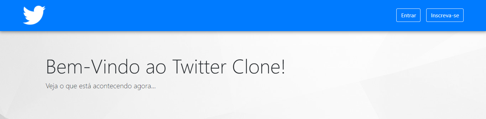
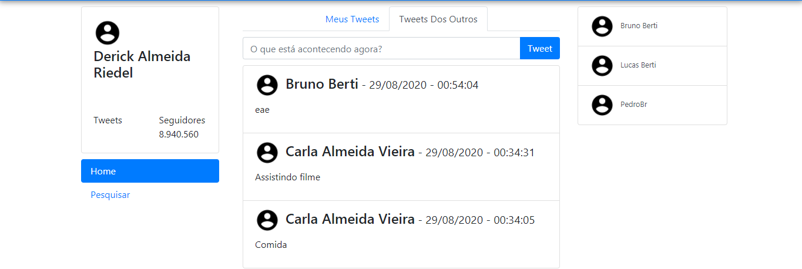

# twitter_copia
Projeto de uma cópia do twitter. 
Nesse projeto eu criei uma cópia do twitter totalmente do zero usando php, bootstrap, javaScript e MySQL

# Index Page:

 
 

# Home Page:

 
 

# Search Page:

 
 

# Tweets Page:

